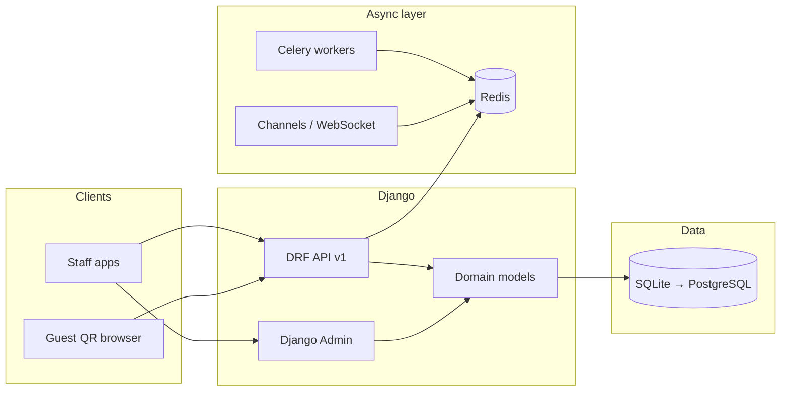

# Restaurant operations backend

A **Django** and **Django REST Framework** service built for **one restaurant per deployment**. It models dine-in QR ordering, table session lifecycle, menu and pricing, orders across multiple channels (dine-in, Swiggy, Zomato), billing and payments, and analytics rollups — so your product team can ship staff apps, guest ordering, and kitchen displays against a single coherent API.

This is **not** a multi-tenant SaaS: there is no "switch restaurant" inside one database. You scale by **separate deployments** (and databases) per venue, reusing the same codebase and pointing each branded frontend at its own backend URL and environment variables.

---

## What this is not

- **Not multi-tenant** — no "switch restaurant" feature inside one database. One deployment = one restaurant. Multi-venue scale is an infrastructure concern, not an application one.
- **Not a delivery platform** — Swiggy and Zomato manage their own riders. This system pulls orders from their APIs; it does not manage who delivers them.
- **Not a customer-facing app** — branding, UI, and guest experience live entirely in the frontend. This backend is purely operational: receipts, configuration, and data.
- **Not a waiter management system** — customers self-order via QR at the table. There is no waiter role because there is no waiter action left to model.

---

## At a glance

| Topic | Status |
|-------|--------|
| **Data model** | Implemented: venue config, tables, menu with add-ons and multi-image support, sessions, orders with human-readable order numbers, bills, payments, analytics, staff users |
| **Django Admin** | Registered for operational setup (menu, tables, users, orders, sessions, billing) |
| **REST API** | Versioned URL layout `/api/v1/...` wired; per-resource endpoints are the next implementation phase (views and routes are stubs) |
| **Authentication** | JWT defaults configured in DRF; token URLs to be mounted when auth API is built |
| **Real-time** | Django Channels + Redis configured; consumers to be written (kitchen display, order tracking, live dashboard) |
| **Background jobs** | Celery app defined in `config/celery.py`; tasks to be added per feature (aggregator polling, analytics, cleanup) |
| **Database** | SQLite for development; PostgreSQL path documented and ready for production switch |

For field-level schema detail and design decisions, see **`LLM_CONTEXT.md`**.

---

## What the platform covers

- **Venue profile** — Legal and contact data, tax rate, currency, timezone. Editable at runtime via admin without redeployment. Branding assets (logos, themes) live in the frontend; this model holds operational truth for receipts and configuration only.

- **Floor and tables** — Table numbers, sections (indoor / outdoor / VIP / bar), capacity, and a lifecycle status that includes `reserved`, `occupied`, `bill_requested`, and `cleaning`. The `bill_requested` status is distinct from `occupied` so QR flows can block new ordering while a bill is being settled — without this distinction, you cannot tell whether a customer is still ordering or has asked for their check.

- **Menu** — Categories and items with price, descriptions, multiple images per item (one primary for cards, additional for detail gallery), dietary flags (vegetarian, vegan, spicy), availability states, cost price for margin reporting, prep time for kitchen display, bestseller and new-item badges for frontend highlighting. Each item supports add-on groups (e.g. "Crust Type", "Spice Level") with individual options that carry their own price delta. Add-on selections are snapshotted at order time so historical bills are always accurate.

- **Table sessions** — One session per customer visit. All orders placed during that visit attach to the session. The bill attaches to the session. When payment is collected the session closes and the table resets to empty. This is what makes multi-round ordering clean — a customer can scan and reorder after their first round arrives without starting a new bill.

- **Orders** — Dine-in (linked to a session) and aggregator channels (Swiggy, Zomato). Each order carries a human-readable `order_number` in the format `YYYYMMDD-NNNN` (e.g. `20240315-0042`), date-scoped and auto-generated on save. Line items snapshot item name, unit price, and all selected add-on names and prices at order time — historical bills are always correct regardless of future menu or add-on changes. Special requests for customer notes on the kitchen display. External order ID (unique) for idempotent Swiggy/Zomato webhook handling.

- **Billing** — One bill per table session. Payments track method, gateway, and commission fields snapshotted at transaction time so historical settlement reports are immutable even when aggregator rates change. Razorpay reference fields stored for verification and dispute resolution.

- **Analytics** — Daily and per-menu-item aggregates. Populated by Celery tasks once those are built. Feeds reporting dashboards and margin analysis.

---

## Roles — three, not six

The original brief had six roles. We cut to three based on what actions actually exist in this system.

| Role | What they do |
|------|-------------|
| `manager` | Full access. Menu edits, staff management, reports, unlocking bills, force-closing sessions, restaurant config. |
| `captain` | Floor operations. Accepts orders, locks bills, collects payment, manages table status. |
| `kitchen` | KDS only. Marks orders ready. No billing, no menu editing. |

**Waiter removed** — customers self-order via QR. The waiter's only job was taking orders; the QR replaces it entirely.

**Delivery removed** — Swiggy and Zomato manage their own riders. No action in this system belongs to a delivery person.

**Super Admin removed** — no platform layer exists in this deployment model. The manager is the highest authority in their own deployment.

---

## Architecture



- HTTP API and Admin share the same models and migrations.
- Redis backs both Celery (background tasks) and Channels (WebSockets).
- Guest QR browser hits the API directly — no admin access, no authentication required for menu browsing and order placement (validated by session token instead).

---

## Key design decisions

**Single-tenant per deployment.** Every model is scoped to one restaurant by the database itself, not by a `restaurant_id` FK on every table. Queries are simpler, joins are fewer, and there is no risk of data leaking across tenants.

**`TableSession` as first-class model.** Orders do not attach directly to a Table because a table is reused every night. The session represents one customer visit. This is what makes multi-round ordering, per-visit billing history, and accurate table duration analytics possible.

**Price and commission snapshotting.** `OrderItem` copies `name` and `unit_price` from `MenuItem` at the moment of order creation. Each selected add-on is stored as `OrderItemAddOn` with snapshotted `name` and `additional_price` (the live `AddOnOption` is only referenced with `SET_NULL` for traceability if the row is deleted). `Payment` copies `commission_pct` and `commission_amount` at the moment of payment. None of these reference live menu or partner rates when reconstructing a historical bill or settlement report.

**`Table.status = bill_requested`.** A distinct status between `occupied` and `empty`. When a captain locks the bill, the table moves to `bill_requested`. The QR flow checks this status and shows a "bill in progress" screen instead of the menu, preventing new orders from being placed while payment is in progress.

**`external_order_id` unique constraint on `Order`.** Swiggy and Zomato webhooks are not guaranteed to fire exactly once. This field makes delivery order ingestion idempotent — if the same order ID arrives twice, the second write is silently skipped at the database level.

**Secrets in environment, not in `RestaurantConfig`.** API keys, payment credentials, and commission percentages are loaded from environment variables. `RestaurantConfig` holds only what a manager might legitimately edit at runtime through the admin — name, address, tax rate, timezone. Secrets are deployment concerns, not data concerns.

---

## Model relationships — add-ons and images

**Add-on chain:**  
`MenuItem` → `AddOnGroup` → `AddOnOption` → (at order time) → `OrderItemAddOn`

- One `MenuItem` can have many `AddOnGroup` rows ("Crust", "Extras", "Spice").
- One `AddOnGroup` can have many `AddOnOption` rows ("Thin", "Thick", "Stuffed").
- `AddOnGroup.is_required`, `min_selections`, and `max_selections` drive frontend validation (required radio, optional checkbox, pick up to N).
- When an order is placed, selected `AddOnOption` rows are snapshotted into `OrderItemAddOn` — `name` and `additional_price` are copied; the line item does not reference live add-on rows after that.

**Image chain:**  
`MenuItem` → `MenuItemImage` (one-to-many)

- `is_primary=True` marks the image used on menu listing cards.
- Additional images are intended for the item detail modal gallery.
- Ordering is controlled by `sort_order`.

**Order numbering:**  
`Order.order_number` is auto-generated on first save. Format: `YYYYMMDD-NNNN`. The sequence resets per calendar day. Uniqueness is enforced at the database level. Used on kitchen display, guest tracking, and receipts.

---

## Security notes

- API keys and payment secrets are loaded from environment variables via `config/settings/base.py`. They are never stored in the database or exposed through any serializer.
- Payment records snapshot commission and gateway references so historical reports remain accurate when partner rates change.
- Table QR tokens exist in the database for session validation. Public serializers intentionally omit QR material — guest-facing endpoints do not expose them. Staff serializers include full table data.
- `RestaurantConfig` is a singleton enforced at the admin level and via `apps.venue.selectors.get_restaurant_config()`, which raises if there are zero or more than one rows.

---

## Technology

| Layer | Choice |
|-------|--------|
| Framework | Django 4.2+, Django REST Framework |
| API style | REST, versioned at `/api/v1/` |
| Auth | JWT via `djangorestframework-simplejwt` (configured, endpoints to be mounted) |
| WebSockets | Django Channels, Redis channel layer |
| Background tasks | Celery, Redis broker (`config/celery.py`) |
| CORS | `django-cors-headers`, origins from environment |
| Database (dev) | SQLite |
| Database (prod) | PostgreSQL (`psycopg2-binary` in requirements) |

`manage.py` defaults to development settings. `config/asgi.py` defaults to production settings so WebSocket deployments are never accidentally pinned to `DEBUG=True`.

---

## Repository layout

```
restro_backend/
├── manage.py
├── requirements.txt
├── README.md                 ← this document (product and engineering orientation)
├── LLM_CONTEXT.md            ← full schema, field rationale, handoff for engineers and LLMs
├── config/
│   ├── __init__.py           # exposes celery_app for autodiscovery
│   ├── celery.py             # Celery app configuration
│   ├── settings/
│   │   ├── base.py           # shared settings, env-backed secrets, SQLite
│   │   ├── development.py    # DEBUG=True
│   │   └── production.py     # DEBUG from env, SSL redirect
│   ├── urls.py               # admin + /api/v1/ includes
│   ├── wsgi.py               # defaults to production settings
│   └── asgi.py               # defaults to production settings (Channels)
└── apps/
    ├── accounts/             # Staff users — roles: manager, captain, kitchen
    ├── venue/                # RestaurantConfig (singleton), Table, selectors
    ├── menu/                 # Category, MenuItem, AddOnGroup, AddOnOption, MenuItemImage
    ├── sessions/             # TableSession (DB label: table_sessions)
    ├── orders/               # Order, OrderItem, OrderItemAddOn
    ├── billing/              # Bill, Payment
    └── analytics/            # DailyAnalytics, ItemAnalytics
```

Each app contains `models.py`, `admin.py`, `serializers.py`, `views.py`, `urls.py`, and versioned migrations. **Commit migrations to Git** — every environment must apply the same schema.

---

## Environment variables

Configure via `.env` (not committed) or your host's secret store.

```
# Core
SECRET_KEY=
DEBUG=
ALLOWED_HOSTS=

# CORS
CORS_ALLOWED_ORIGINS=          # comma-separated

# Redis (Celery + Channels)
REDIS_URL=

# Aggregator integrations
SWIGGY_API_KEY=
SWIGGY_COMMISSION_PCT=
ZOMATO_API_KEY=
ZOMATO_COMMISSION_PCT=

# Payments
RAZORPAY_KEY_ID=
RAZORPAY_KEY_SECRET=

# Database (inactive until PostgreSQL switch)
# POSTGRES_DB=
# POSTGRES_USER=
# POSTGRES_PASSWORD=
# POSTGRES_HOST=
# POSTGRES_PORT=
```

---

## Local development

```bash
cd restro_backend
python -m venv .venv

# Windows
.venv\Scripts\activate
# macOS / Linux
source .venv/bin/activate

pip install -r requirements.txt

set DJANGO_SETTINGS_MODULE=config.settings.development   # Windows
export DJANGO_SETTINGS_MODULE=config.settings.development  # macOS / Linux

python manage.py migrate
python manage.py createsuperuser   # requires email, phone, name
python manage.py runserver
```

- **Admin:** `http://127.0.0.1:8000/admin/`
- **API base:** `/api/v1/` — endpoints resolve once views and routes are implemented
- **Schema reference:** `LLM_CONTEXT.md` — every model field, label, and design rationale

**Celery (when tasks are added):**
```bash
celery -A config worker -l info
```
Requires Redis running and `DJANGO_SETTINGS_MODULE` set.

---

## Delivery roadmap

**Done**
- Domain models and migrations across all apps
- Django Admin registration for all models
- Project wiring: CORS, JWT DRF defaults, Redis/Celery/Channels config, ASGI production default

**Next — build in this order**
1. JWT auth endpoints — login, refresh, logout (`/api/v1/auth/`)
2. Menu API — categories and items, public reads, manager-only writes
3. Table and session API — QR token validation, session lifecycle, bill lock/unlock
4. Orders API — place order, captain confirm, KDS status flow (confirm → preparing → ready → served)
5. Billing API — live bill aggregation, payment collection, Razorpay integration

**Then**
- Django Channels consumers — KDS live updates, customer order tracking, manager dashboard
- Celery tasks — Swiggy/Zomato polling every 30 seconds, nightly analytics aggregation, optional housekeeping jobs

**Production**
- Switch `DATABASES` to PostgreSQL
- Harden `production.py` — static files, logging, full security headers
- Deploy ASGI server (Daphne or Uvicorn) + Celery worker processes

---

## Multi-restaurant deployment

To serve a new restaurant: deploy a new instance with its own database, its own `.env`, and a reskinned frontend pointing at the new backend URL. The codebase does not change. Data never mixes.

---

## Documentation map

| Document | Audience |
|----------|----------|
| **README.md** | Product owners, new engineers, clients — orientation and trust |
| **LLM_CONTEXT.md** | Engineers and LLMs — every model field, app label, migration state, and design decision |