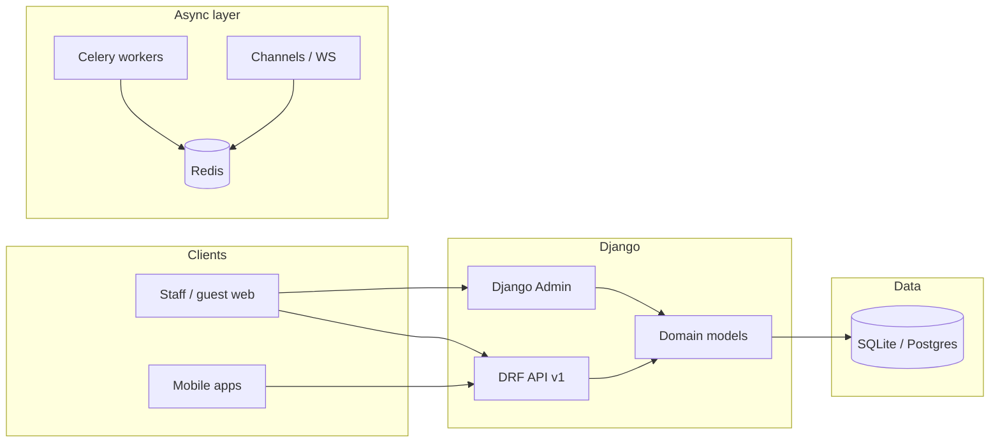

# Restaurant operations backend

A **Django** and **Django REST Framework** service built for **one restaurant per deployment**. It models dine-in (QR and table sessions), menu and pricing, orders across multiple channels, billing and payments, analytics rollups, and an audit trail—so your product team can ship staff apps, guest ordering, and kitchen displays against a single coherent API.

This is **not** a multi-tenant SaaS: there is no “switch restaurant” inside one database. You scale by **separate deployments** (and databases) per venue, reusing the same codebase and pointing each branded frontend at its own backend URL and environment.

---

## At a glance (for stakeholders)

| Topic | Status |
|--------|--------|
| **Data model** | Implemented: venues, tables, menu, sessions, orders, bills, payments, analytics, audit, staff users |
| **Django Admin** | Registered for operational setup (menu, tables, users, orders, etc.) |
| **REST API** | **Versioned URL layout** (`/api/v1/...`) is wired; **per-resource endpoints are the next implementation phase** (views/routes are stubs) |
| **Authentication** | JWT-oriented defaults in DRF; token URLs to be mounted when auth API is built |
| **Real-time** | **Django Channels** + **Redis** configured for future WebSockets (e.g. kitchen tickets, table status) |
| **Background jobs** | **Celery** app defined (`config/celery.py`); workers and tasks to be added as features need them |
| **Database** | **SQLite** for rapid development; **PostgreSQL** path documented for production |

For a **developer handoff** with field-level detail, see **`LLM_CONTEXT.md`** in this folder.

---

## What the platform covers (business language)

- **Venue profile** — Legal and contact data, tax rate, currency, timezone (editable in admin). Branding assets (logos, themes) stay in your **frontend**; the backend keeps **operational** truth for receipts and configuration.
- **Floor & tables** — Table numbers, sections (indoor / outdoor / VIP / bar), capacity, and lifecycle status including **reserved**, **occupied**, and **bill requested** (so QR flows can block ordering while a bill is in progress).
- **Menu** — Categories and items with price, optional description and image URL, dietary flags, availability, **cost price** (for margin reporting), and **prep time** (for kitchen display urgency).
- **Table sessions** — Links guests at a table to QR usage, captain assignment, and optional **session notes** (e.g. birthday, VIP).
- **Orders** — Dine-in (linked to session), website, takeaway, phone, and aggregator channels; line items snapshot names and prices; **special requests** for KDS; **external order ID** (unique) for Swiggy/Zomato **idempotent** webhook handling.
- **Billing** — One bill per table session; payments with method and gateway; **commission and settlement fields snapshotted** on payment for historical accuracy; Razorpay reference fields for verification and disputes.
- **Analytics** — Daily and per-menu-item aggregates (feeds reporting and dashboards once jobs populate them).
- **Audit** — Structured log of who did what, with optional **IP** for accountability and abuse detection.

---

## Architecture (high level)



- **HTTP API** and **Admin** share the same **models** and migrations.
- **Redis** backs **Celery** and **Channels** when you enable background work and WebSockets.

---

## Security and configuration (how we treat sensitive data)

- **API keys and payment secrets** (Swiggy, Zomato, Razorpay, default commission percentages used in code) are loaded from **environment variables** via `config/settings/base.py`. They are **not** stored on `RestaurantConfig` or exposed through serializers by design.
- **Payment records** store **snapshots** of commission and gateway references so historical reports stay correct when partner rates change.
- **Table QR tokens** exist in the database for your app logic; **public serializers intentionally omit** QR material so guest-facing list endpoints do not leak them—staff-only serializers include full table data when you implement those routes.
- **`RestaurantConfig`** is a **singleton**: exactly one row per database, enforced in admin and via `apps.venue.selectors.get_restaurant_config()` for safe access in code.

---

## Technology choices

| Layer | Choice |
|--------|--------|
| Framework | Django 4.2+, Django REST Framework |
| API style | REST, URL prefix `/api/v1/` |
| Auth (planned) | JWT (`djangorestframework-simplejwt`) |
| HTTP server | WSGI (`gunicorn`/`uvicorn` in production—your ops choice) |
| WebSockets | Django Channels, Redis channel layer |
| Tasks | Celery, Redis broker (app in `config/celery.py`) |
| CORS | `django-cors-headers`, origins from env |
| DB (dev) | SQLite file `db.sqlite3` |
| DB (prod path) | PostgreSQL (`psycopg2-binary` in requirements) |

**Runtime files:** `manage.py` uses **development** settings by default. **`config/asgi.py`** defaults to **production** settings so ASGI/WebSocket deployments are not accidentally tied to `DEBUG=True`.

---

## Repository layout

```
restro_backend/
├── manage.py
├── requirements.txt
├── README.md                 ← this document
├── LLM_CONTEXT.md            ← detailed schema / handoff for engineers
├── config/
│   ├── __init__.py           # Celery app import
│   ├── celery.py             # Celery configuration
│   ├── settings/             # base, development, production
│   ├── urls.py               # admin + api/v1 includes
│   ├── wsgi.py
│   └── asgi.py
└── apps/
    ├── accounts/             # Staff users (roles: manager, captain, kitchen)
    ├── venue/                # RestaurantConfig (singleton), Table, selectors
    ├── menu/                 # Category, MenuItem
    ├── sessions/             # TableSession (DB label: table_sessions)
    ├── orders/               # Order, OrderItem
    ├── billing/              # Bill, Payment
    ├── analytics/            # DailyAnalytics, ItemAnalytics
    └── audit/                # AuditLog
```

Each app typically contains `models.py`, `admin.py`, `serializers.py` (stubs), `views.py` (stubs), `urls.py` (stubs), and versioned **migrations**—**commit migrations to Git** so every environment applies the same schema.

---

## Environment variables (overview)

Configure via `.env` (not committed) or your host’s secret store. Commonly used names include:

- **Core:** `SECRET_KEY`, `DEBUG`, `ALLOWED_HOSTS`
- **CORS:** `CORS_ALLOWED_ORIGINS` (comma-separated)
- **Redis:** `REDIS_URL` (Celery + Channels)
- **Integrations:** `SWIGGY_API_KEY`, `ZOMATO_API_KEY`, `RAZORPAY_KEY_ID`, `RAZORPAY_KEY_SECRET`, `SWIGGY_COMMISSION_PCT`, `ZOMATO_COMMISSION_PCT`

---

## Local development

```bash
cd restro_backend
python -m venv .venv
# Windows:
.venv\Scripts\activate
pip install -r requirements.txt
set DJANGO_SETTINGS_MODULE=config.settings.development
python manage.py migrate
python manage.py createsuperuser
python manage.py runserver
```

- **Admin:** `http://127.0.0.1:8000/admin/`
- **API base (stubs):** paths under `/api/v1/...` resolve once views and routes are implemented.

**Celery (when you add tasks):** run a worker with Redis available, e.g. `celery -A config worker -l info` (set `DJANGO_SETTINGS_MODULE` as appropriate).

---

## Delivery roadmap (suggested)

1. **Done:** Domain model, migrations, admin, project wiring (CORS, JWT defaults, Redis/Celery/Channels config, ASGI).
2. **Next:** Mount JWT login/refresh URLs; implement authenticated CRUD and workflows (menu, tables, sessions, orders, billing).
3. **Then:** Channel consumers for live updates; Celery tasks (aggregators polling, nightly analytics, housekeeping).
4. **Production:** Switch `DATABASES` to PostgreSQL, harden `production.py` (static files, HTTPS, logging), deploy ASGI + worker processes.

---

## Multi-restaurant strategy

To serve **another restaurant**, deploy a **new instance** with its own database, secrets, and frontend. The codebase stays the same; you do **not** mix multiple venues in one database with this design.

---

## Documentation map

| Document | Audience |
|----------|----------|
| **README.md** (this file) | Product owners, clients, new engineers—orientation and trust |
| **LLM_CONTEXT.md** | Deep technical snapshot: every model field, labels, and conventions |

Questions about **why** a table status or payment field exists are answered in code docstrings and in **`LLM_CONTEXT.md`** section 12 (design decisions).
